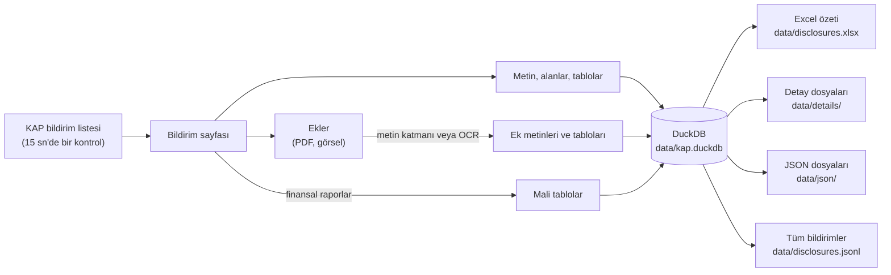

# KAP Scraper

[KAP](https://www.kap.org.tr) (Kamuyu Aydınlatma Platformu) için gerçek zamanlı bir veri toplayıcı. FinTrex için geliştirildi.

KAP'ta yayımlanan her yeni bildirimi saniyeler içinde yakalar ve içindeki her şeyi kaydeder:

- bildirimin metni, alanları ve tabloları,
- ekteki PDF ve görsellerin metni ve tabloları, taranmış belgeler için OCR dahil,
- finansal raporlardaki mali tablolar, dönemleriyle birlikte sayısal değerler olarak.

Tüm veriler tek bir [DuckDB](https://duckdb.org) veritabanında tutulur. Hızlıca göz atmak için ayrıca bildirimleri listeleyen bir Excel özeti ve her bildirim için okunaklı bir detay dosyası üretilir. Her bildirim ayrıca, bir modele ya da başka bir programa verilmek üzere tek bir JSON dosyası olarak da saklanır. Model eğitimi için tüm bildirimler tek bir JSON Lines dosyasında da toplanır.

İstenirse canlı akış yerine, başlangıç ve bitiş tarihi verilen bir aralıktaki geçmiş bildirimleri de çeker.

> **Resmî değildir.** Bu proje KAP veya MKK ile bağlantılı değildir. KAP web sitesinin kendisinin kullandığı iç uç noktaları okur. Bu uç noktalar belgelenmemiştir ve haber verilmeden değişebilir. İstek sıklığını düşük tutun ve KAP'ın kullanım koşullarına uyun.

## Özellikler

- **Gerçek zamanlı izleyici.** KAP'ı 15 saniyede bir kontrol eder ve her yeni bildirimi hemen işler.
- **Geçmiş.** `kap_history.py`, başlangıç ve bitiş tarihi verilen aralıkta yayımlanan her bildirimi çeker. Kaldığı yerden devam eder.
- **Eğitim verisi.** Sayfası ve tüm ekleri okunan her bildirim `data/disclosures.jsonl` dosyasına bir satır olarak eklenir.
- **Bildirim sayfaları.** Düz metin, etiket-değer alanları ve tablolar. KAP bir alanı XBRL kavramıyla etiketlemişse kavram adı da saklanır.
- **Ekler.** PDF ve görseller bellekte indirilir, diske hiç yazılmaz.
  - Metin, PDF'in metin katmanından ya da taranmış sayfa ve görsellerde Tesseract OCR ile çıkarılır.
  - Tablolar PyMuPDF'in tablo bulucusuyla çıkarılır. Taranmış belgelerde tablolar çizgilerinden bulunur ve her hücre ayrı ayrı OCR'dan geçirilir. Böylece hiçbir değer yanlış satıra ya da sütuna kayamaz.
- **Mali tablolar.** Bilanço, kâr veya zarar tablosu, diğer kapsamlı gelir tablosu, nakit akış tablosu ve özkaynak değişim tablosu. Her satırda tek bir sayısal değer bulunur. Değerin XBRL kavramı, dönemi ve özkaynak tablosunda ait olduğu özkaynak kalemi de saklanır.
- **KAP'ın sınırlarına uyumlu.** İstek sınırına takılınca bekler, yavaşlatılan indirmeleri bir süre sınırından sonra bırakır ve daha sonra yeniden dener.

## Nasıl çalışır



1. **Bildirim listesi.** KAP ana sayfasının attığı isteğin aynısı gönderilir:
   `POST https://www.kap.org.tr/tr/api/disclosure/list/main`, gövdesi
   `{"fromDate": "GG.AA.YYYY", "toDate": "GG.AA.YYYY", "memberTypes": ["IGS", "DDK"]}`.
   Gelen JSON yanıtında her bildirim için bir kayıt bulunur. Fon bildirimleri istenmez.
2. **Bildirim sayfası.** `https://www.kap.org.tr/tr/Bildirim/{disclosure_index}` sunucu tarafında üretilen bir HTML sayfasıdır. KAP iki farklı sayfa düzeni kullanır:
   - **legacy (eski düzen):** etiket-değer satırları, bölüm başlıkları, kenarlıklı tablolar ve serbest metin blokları;
   - **xbrl:** her satırda `ifrs-full_CashAndCashEquivalents` gibi bir XBRL kavramı, Türkçe ve İngilizce etiket ve değerler bulunur. Sadece Türkçe metin saklanır.

   Bildirim gövdesinin ham HTML'i de saklanır. Böylece sayfalar daha sonra KAP'a gitmeden yeniden ayrıştırılabilir.
3. **Ekler.** Dosyalar `https://www.kap.org.tr/tr/api/file/download/{file_id}` adresinden iner. KAP her dosyayı serileştirilmiş bir Java bayt dizisinin içine sarar: 23 baytlık bir başlık, 4 baytlık bir uzunluk bilgisi ve ardından dosyanın kendisi. Betik dosyayı okumadan önce bu sarmalı açar.
4. **Mali tablolar.** Finansal rapor sayfalarında her mali tablo, XBRL etiketli ayrı bir HTML tablosudur. Olağan tablolarda her değer sütunu bir dönem başlığına aittir. Özkaynak değişim tablosunda ise sütunlar özkaynak kalemleridir, dönemler satır grupları olarak gelir.

## Gereksinimler

- **Python.** Windows 11 üzerinde Python 3.14 ile test edildi.
- **Tesseract OCR 5** ve Türkçe dil verisi. Taranmış ekleri okumak için gerekir.
- **Bilgisayar saati Türkiye saatinde olmalı** (Europe/Istanbul). KAP yayın saatleri Türkiye yerel saatidir ve izleyici bunları bilgisayarın saatiyle karşılaştırır.

## Kurulum (Windows)

1. Depoyu klonlayın ve Python paketlerini kurun:

   ```powershell
   git clone https://github.com/Simittin/kap-scrapper-.git
   cd kap-scrapper-
   python -m venv .venv
   .venv\Scripts\Activate.ps1
   pip install -r requirements.txt
   ```

   PowerShell `Activate.ps1` dosyasını çalıştırmayı reddederse, kendi kullanıcınız için yerel betiklere şu komutla izin verin:
   `Set-ExecutionPolicy -Scope CurrentUser RemoteSigned`.

2. Tesseract OCR'ı kurun:

   ```powershell
   winget install UB-Mannheim.TesseractOCR
   ```

3. Dil dosyalarını hazırlayın. `Program Files` altına yazmak yönetici izni gerektirdiği için proje kendi `tessdata` klasörünü kullanır:

   ```powershell
   mkdir tessdata
   copy "C:\Program Files\Tesseract-OCR\tessdata\eng.traineddata" tessdata\
   copy "C:\Program Files\Tesseract-OCR\tessdata\osd.traineddata" tessdata\
   curl.exe -L -o tessdata\tur.traineddata https://github.com/tesseract-ocr/tessdata_best/raw/main/tur.traineddata
   ```

4. Yerel ayar dosyanızı oluşturun ve yolları doldurun:

   ```powershell
   copy .env.example .env
   ```

   | Değişken | Değer |
   |---|---|
   | `TESSERACT_CMD` | `tesseract.exe` dosyasının tam yolu. Genelde `C:\Program Files\Tesseract-OCR\tesseract.exe` |
   | `TESSDATA_PREFIX` | Projedeki `tessdata` klasörünün tam yolu |

   `kap_watch.py`, `kap_history.py` ve `kap_attachments.py` bu ayarlara ihtiyaç duyar. `TESSERACT_CMD` tanımlı değilse başlarken durur.

### Linux ve macOS (test edilmedi)

Kodda Windows'a özgü bir kısım yok, ancak sadece Windows'ta çalıştırıldı. Debian veya Ubuntu'da:

```bash
sudo apt install tesseract-ocr tesseract-ocr-tur
python3 -m venv .venv && source .venv/bin/activate
pip install -r requirements.txt
cp .env.example .env
```

Ardından `.env` dosyasında `TESSERACT_CMD=/usr/bin/tesseract` ve `TESSDATA_PREFIX=/usr/share/tesseract-ocr/5/tessdata` olarak ayarlayın. Bir sunucuda çalıştıracaksanız saat dilimini Europe/Istanbul yapın.

## Kullanım

İki çalışma şekli vardır. Aynı anda yalnızca biri çalıştırılır:

| Ne istiyorsunuz | Komut |
|---|---|
| Yeni bildirimleri yayımlandıkları anda yakalamak | `python kap_watch.py` |
| Bir tarih aralığındaki geçmiş bildirimleri çekmek | `python kap_history.py --start 01.01.2025 --end 31.12.2025` |

İkisi de her bildirimi aynı şekilde işler ve aynı veritabanına, aynı dosyalara yazar.

### Gerçek zamanlı izleyici

Başlatın ve açık bırakın:

```powershell
python kap_watch.py
```

Her yeni bildirim ekranda tek bir satır olarak görünür. Örnek çıktı, değerler temsilîdir:

```text
[09:30:02] Watching KAP every 15 s for disclosures published after 06.10 09:20:02. Ctrl+C to stop.
[09:31:17] NEW 1672701 ASELS: Yeni İş İlişkisi (published 09:31:05, caught after 12 s)
[09:31:29]   attachment 1672701 'Sozlesme.pdf': 3 pages, 0 OCR, 1 tables
[09:42:48]   financial statements of 1672720: 498 values
[09:42:48] NEW 1672720 BTCIM: Finansal Rapor (published 09:42:36, caught after 12 s)
```

- **Neyi işler.** İzleyici başladıktan sonra yayımlanan bildirimleri ve başlangıçtan önceki 10 dakikayı işler. Böylece kısa bir yeniden başlatmada hiçbir şey kaçmaz. Daha eski bildirimler için `kap_history.py` kullanın (aşağıda).
- **İş sırası.** Önce bildirim sayfası çekilip kaydedilir. Bildirim finansal raporsa mali tablolar da aynı anda çıkarılır. Ekler arka plandaki bir işçiye gider. Böylece uzun bir OCR işi bir sonraki bildirimi geciktirmez.
- **Hatalar.** Alınamayan bir bildirim sayfası bir sonraki kontrolde yeniden denenir, en fazla 3 kez. Başarısız olan ekler, ek işçisi boştayken 5 dakikada bir yeniden kuyruğa alınır.
- **Excel, detay ve JSON dosyaları.** Bildirimin detay ve JSON dosyaları sayfası kaydedilir kaydedilmez yazılır ve her ek işlendiğinde güncellenir. Excel özeti yeni veri geldiğinde yeniden yazılır. Dosya Excel'de açıksa değiştirilemez. İzleyici bunu ekrana yazar ve bir sonraki değişiklikte yeniden dener.
- **JSON Lines dosyası.** Her kontrolde, sayfası ve tüm ekleri okunmuş yeni bildirimler `data/disclosures.jsonl` dosyasına eklenir. Ekleri olan bir bildirim, son eki de işlendikten sonra eklenir.
- **Durdurma.** Ctrl+C'ye basın. Kuyrukta kalan ekler ekrana yazılır. Onları tamamlamak için `python kap_attachments.py` komutunu ya da o günler için `kap_history.py` komutunu çalıştırın.

İzleyici çalıştığı sürece veritabanını açık tutar. DuckDB buna aynı anda yalnızca tek bir sürecin izin verir. Geçmiş çekimini ya da toplu çalıştırma betiklerini başlatmadan, veya veritabanını başka bir yerden açmadan önce izleyiciyi durdurun.

### Geçmiş bildirimler

Bir başlangıç ve bir bitiş günü verin. İki gün de aralığa dahildir:

```powershell
python kap_history.py --start 01.01.2025 --end 31.12.2025
```

Aralıktaki her bildirim, izleyicideki gibi tamamlanır: sayfa, finansal raporların mali tabloları ve ekler. Bunu iki işçi birlikte yapar:

- **Sayfa işçisi** günleri bitiş gününden başlangıç gününe doğru gezer. Her günün listesini, sonra bildirimlerin sayfalarını çeker.
- **Ek işçisi** sayfası kaydedilmiş bildirimlerin eklerini, en yeniden başlayarak okur. KAP ekleri çoğu zaman saniyede yaklaşık 20 KB hızla verir. Bu yüzden ekler ayrı bir işçidedir ve sayfa çekimini yavaşlatmaz.

Davranışı:

- **Kaldığı yerden devam eder.** Tamamlanmış sayfalar ve okunmuş ekler atlanır. Geçmiş bir günün listesi bir kez çekilir ve `listed_days` tablosuna işaretlenir. Aynı komutu yeniden çalıştırmak, durduğu yerden devam eder. Bugünün listesi henüz tamamlanmadığı için her çalıştırmada yeniden çekilir.
- **Hatalar.** Bir sayfa, ek ya da günün listesi alınamazsa ekrana yazılır ve aynı komutun bir sonraki çalıştırılmasında yeniden denenir.
- **Bitiş.** Tüm sayfalar çekilip ekler de bittiğinde betik kendiliğinden kapanır. Ctrl+C ile istediğiniz an durdurabilirsiniz.
- **JSON Lines dosyası.** Tamamlanan bildirimler her günün sonunda ve ekler bitmeyi beklerken düzenli olarak `data/disclosures.jsonl` dosyasına eklenir.

Süre: KAP'ta iş günü başına yaklaşık 330 bildirim yayımlanır. Ekim 2026'daki testlerde, ekler paralel inerken bir sayfa ortalama 5 ile 6,5 saniye sürdü. Buna göre bir iş günü yaklaşık 30 ile 35 dakika, bir yıllık geçmiş yaklaşık 6 gün sürer. Ekler, KAP'ın indirme hızına bağlı olarak buna paralel ilerler. 2 MB'lık bir PDF'in inmesi 80 saniye sürebilir.

Örnek çıktı, değerler temsilîdir:

```text
[09:30:02] Fetching disclosures published from 01.01.2025 to 31.12.2025, newest day first. Ctrl+C to stop.
[09:30:03] 31.12.2025: fetching 212 pages.
[09:30:31]   attachment 1612345 'Sozlesme.pdf': 2 pages, 2 OCR, 0 tables
[09:42:10] 31.12.2025: fetched 212 pages, 0 failed.
[09:42:14] 30.12.2025: fetching 331 pages.
```

### Toplu çalıştırma

İşi tek tek adımlarla yapmak ya da yarım kalan işi tamamlamak için bu betikleri sırayla çalıştırın:

| Adım | Komut | Ne yapar |
|---|---|---|
| 1 | `python kap_disclosures.py --start 01.10.2026 --end 05.10.2026` | Aralıktaki her günün bildirim listesini çeker. Tarih verilmezse bugünü çeker. |
| 2 | `python kap_details.py --limit 50` | Detayı henüz çekilmemiş bildirimlerin sayfalarını en yeniden başlayarak çeker. `--limit` verilmezse hepsini çeker. |
| 3 | `python kap_attachments.py --limit 20` | Metni henüz çıkarılmamış ekleri indirir, metinlerini ve tablolarını çıkarır. `--limit` verilmezse hepsini işler. |
| 4 | `python kap_financials.py` | Saklı finansal rapor sayfalarından mali tablo satırlarını üretir. KAP'a istek atmaz. |

2, 3 ve 4. adımlar sadece eksik kalanları işler. Bu yüzden istediğiniz an durdurup yeniden başlatabilirsiniz. 1. adım verilen günleri yeniden çeker ve var olan satırları günceller. Her kayıt tek bir işlem (transaction) içinde yazılır, bu yüzden bir kesinti asla yarım kayıt bırakmaz.

Ayrıştırıcılar değiştiğinde, saklı sayfalar KAP'a gitmeden yeniden işlenebilir:

```powershell
python kap_details.py --reparse     # saklı tüm sayfaların alanları, tabloları ve metni
python kap_financials.py --all      # tüm mali tablolar
python kap_output.py                # Excel özeti, tüm detay ve JSON dosyaları, JSON Lines dosyası
```

Toplu çalıştırma betikleri JSON Lines dosyasına satır eklemez. İzleyici ya da `kap_history.py` bir sonraki çalıştırmada eksik satırları ekler. `python kap_output.py` ise dosyayı baştan yazar.

Toplu çekme, KAP'ın istek sınırları yüzünden yavaştır. Binlerce bildirimin çekilmesi saatler sürebilir. Ayrıntılar için [KAP istek sınırları](#kap-istek-sınırları) bölümüne bakın.

## Çıktılar

### Veritabanı tabloları

Veritabanı `data/kap.duckdb` dosyasıdır. Her tabloda `disclosure_index` sütunu bulunur. Bu, KAP'ın bildirime verdiği numaradır ve sayfa adresinde de geçer. Ek tabloları ayrıca `file_id` ile birbirine bağlanır.

| Tablo | Her satır | Başlıca sütunlar |
|---|---|---|
| `disclosures` | bir bildirim | `publish_date`, `stock_code`, `company_title`, `title`, `summary`, `disclosure_class`, `attachment_count`, `url` |
| `disclosure_details` | çekilmiş bir sayfa | `page_format` (`legacy`, `xbrl` veya `empty`), `text`, `html`, `fetched_at` |
| `disclosure_fields` | sayfadaki bir alan | `section`, `concept` (sadece XBRL sayfalarında), `label`, `value_col`, `value` |
| `disclosure_tables` | eski düzen bir sayfadaki tablo | `section`, `rows_json` (satır listesi, her satır bir hücre listesi) |
| `disclosure_attachments` | bir ek | `file_id`, `file_name`, `url` |
| `attachment_texts` | işlenmiş bir ek | `file_type`, `page_count`, `ocr_pages`, `skipped_pages`, `text` |
| `attachment_tables` | bir ekteki tablonun bir satırı | `page`, `table_no`, `row_no`, `method` (`text` veya `ocr`), `cells` (metin listesi) |
| `financial_items` | mali tablodaki bir değer | `statement`, `concept`, `label`, `member`, `period_label`, `period_start`, `period_end`, `value`, `currency`, `consolidation` |
| `listed_days` | listesi tamamen çekilmiş geçmiş bir gün | `day` |
| `jsonl_exported` | JSON Lines dosyasına yazılmış bir bildirim | `disclosure_index` |

Veriyle ilgili notlar:

- **Bildirim sınıfları.** `ODA` özel durum açıklaması, `FR` finansal rapor, `DUY` duyuru, `DG` diğer bildirimlerdir.
- **Hisse kodları.** Birden fazla aracı ilgilendiren bir bildirimde kodların hepsi yazılır, örneğin `TBY, TEBYT`.
- **Ek metinleri.** Metinde her sayfa `[Page N]` işaretiyle başlar.
- **Mali değerler.** Sayı olarak, KAP'ta gösterildiği haliyle ve `currency` sütunundaki para biriminde saklanır.
- **Şirketleri karşılaştırmak.** `label` yerine `concept` sütununu kullanın, örneğin `ifrs-full_Revenue`. Etiketler şirketten şirkete farklı olabilir, kavramlar ise ortak XBRL taksonomisinden gelir.
- **Dönemler.** `period_label`, KAP'taki sütun başlığıdır: `Cari Dönem`, `Önceki Dönem` ya da `Cari Dönem 3 Aylık` gibi. Bilanço değerleri belirli bir tarihteki durumu gösterdiği için `period_start` boştur.
- **Özkaynak değişim tablosu.** `member` sütunu özkaynak kalemini tutar, toplam sütunu `Özkaynaklar`'dır. Her satır kendi grubunun dönemini taşır. Dönem başı ve dönem sonu bakiyelerini `Dönem Başı Bakiyeler` ve `Dönem Sonu Bakiyeler` etiketli satırlardan okuyun.
- **Birleşik tablolar.** Bazı şirketler kâr veya zarar tablosu ile diğer kapsamlı gelir tablosunu tek tabloda verir: `Kar veya Zarar ve Diğer Kapsamlı Gelir Tablosu`.

### Excel özeti ve detay dosyaları

Bu iki çıktı göz atmak içindir. Tam kayıt her zaman veritabanındadır.

**Excel özeti.** `data/disclosures.xlsx` dosyasında en yeni 5.000 bildirim, her biri tek satır olarak yer alır. Dosya her betik çalıştığında, izleyicide ise her değişiklikten sonra yeniden yazılır. Başlık satırı sabitlenmiştir ve filtreler açıktır.

| Sütun | İçerik |
|---|---|
| `disclosure_index` | KAP'ın bildirim numarası |
| `publish_date` | Yayın zamanı |
| `stock_code`, `company` | Hisse kodu ve şirket adı |
| `title`, `summary` | Bildirimin başlığı ve özeti |
| `class` | Bildirim sınıfı: `ODA`, `FR`, `DUY` veya `DG` |
| `attachments` | KAP'taki ek sayısı |
| `attachments_read` | Metni çıkarılmış ek sayısı |
| `financial_values` | Finansal raporlardan çıkarılan mali değer sayısı |
| `kap` | Bildirimin KAP sayfasına bağlantı |
| `detail_file` | Bildirimin detay dosyasına bağlantı |

**Detay dosyaları.** Detayı çekilmiş her bildirim için `data/details/YYYY-AA-GG/` altına bir Markdown dosyası yazılır, örneğin `data/details/2026-10-05/1672590_GIPTA.md`. Dosyada sırasıyla şunlar bulunur:

- bildirimin genel bilgileri ve KAP bağlantısı,
- sayfadaki alanlar, bölüm bölüm,
- sayfadaki tablolar,
- finansal raporlarda mali tablolar: kalemler satırlarda, dönemler sütunlarda, sayılar KAP'taki gibi `1.234.567` biçiminde,
- ekler: her birinin sayfa sayısı, tabloları ve metni,
- sayfanın tam metni.

Detay dosyaları herhangi bir metin düzenleyicide açılabilir. VS Code'un Markdown önizlemesinde tablolar düzgün görünür.

### JSON dosyaları

Detay dosyasıyla aynı içerik, bir modele ya da başka bir programa verilebilecek şekilde her bildirim için ayrı bir JSON dosyasında da saklanır: `data/json/YYYY-AA-GG/`, örneğin `data/json/2026-10-05/1672590_GIPTA.json`. Dosya, detay dosyasıyla aynı anlarda yazılır ve güncellenir. Böylece yeni yakalanan bir bildirim saniyeler içinde JSON olarak hazır olur.

Dosyalar UTF-8'dir, Türkçe karakterler olduğu gibi yazılır. Bir bildirimin kaydı şu anahtarlardan oluşur:

| Anahtar | İçerik |
|---|---|
| `disclosure_index` … `url` | `disclosures` tablosunun tüm sütunları, aynı adlarla |
| `page_format` | `legacy`, `xbrl` veya `empty`. Sayfa henüz çekilmediyse `null` |
| `fields` | Sayfadaki alanlar: `section`, `concept`, `label`, `value`. Bir alanın birden çok değeri varsa her değer ayrı bir öğedir |
| `tables` | Sayfadaki tablolar: `section` ve `rows` (satır listesi, her satır bir hücre listesi) |
| `financial_statements` | Mali tablolar: `statement`, `currency`, `consolidation` ve `items`. Her öğede `concept`, `label`, `member`, `period_label`, `period_start`, `period_end`, `value` bulunur |
| `attachments` | Ekler: `file_id`, `file_name`, `url`. İşlenmiş eklerde ayrıca `file_type`, `page_count`, `ocr_pages`, `skipped_pages`, `text` ve `tables` (`page`, `method`, `rows`) |
| `text` | Sayfanın tam metni |

- **Tarihler** metin olarak yazılır: `2026-10-05 22:54:09` ya da `2026-06-30`.
- **Mali değerler** sayıdır, örneğin `-20388433.0`.
- **Finansal raporlarda `fields` boştur.** Bu raporların alanları mali tabloların kendisidir ve `financial_statements` içinde zaten yer alır.
- **Henüz işlenmemiş bir ekte** `text` anahtarı yoktur.

Tüm dosyaları Python'dan okumak için:

```python
import json
from pathlib import Path

records = [json.loads(p.read_text(encoding="utf-8")) for p in Path("data/json").rglob("*.json")]
```

### Tüm bildirimler tek dosyada (JSON Lines)

Model eğitimi için tüm bildirimler `data/disclosures.jsonl` dosyasında toplanır. Her satır, yukarıdaki anahtarlarla bir bildirimin tam kaydıdır. JSON Lines seçildi çünkü yeni bir bildirim dosyanın sonuna tek satır olarak eklenebilir. Tek bir JSON dizisi ise her seferinde baştan yazılmak zorunda kalırdı.

- **Ne zaman eklenir.** Bir bildirim, sayfası ve tüm ekleri okunduktan sonra bir kez eklenir. Yani dosyadaki her kayıt tamdır ve her eki için `text` anahtarı vardır. Ekleri henüz okunamamış bildirimler dosyada yoktur.
- **Sıra.** İzleyici satırları tamamlanma sırasıyla ekler. `python kap_output.py` dosyayı baştan, yayın zamanına göre sıralı yazar.
- **Tekrar yok.** Yazılan bildirimler `jsonl_exported` tablosunda tutulur. Böylece aynı bildirim iki kez eklenmez.
- **Ayrıştırıcı değişince.** Var olan satırlar kendiliğinden güncellenmez. Yeniden ayrıştırmadan sonra `python kap_output.py` ile dosyayı baştan yazın.

Okumak için:

```python
import polars as pl

df = pl.read_ndjson("data/disclosures.jsonl")

# ya da Hugging Face datasets ile
from datasets import load_dataset
ds = load_dataset("json", data_files="data/disclosures.jsonl", split="train")
```

### Örnek sorgular

İzleyici kapalıyken veritabanını Python'dan salt okunur modda açın:

```python
import duckdb

con = duckdb.connect("data/kap.duckdb", read_only=True)
df = con.sql("SELECT * FROM disclosures ORDER BY publish_date DESC LIMIT 10").pl()  # Polars DataFrame
```

Bir hissenin son bildirimleri:

```sql
SELECT publish_date, title, summary, url
FROM disclosures
WHERE list_contains(string_split(stock_code, ', '), 'ASELS')
ORDER BY publish_date DESC
LIMIT 20;
```

Eklerin içinde arama:

```sql
SELECT d.publish_date, d.stock_code, d.title, a.file_name
FROM attachment_texts t
JOIN disclosure_attachments a USING (disclosure_index, file_id)
JOIN disclosures d USING (disclosure_index)
WHERE t.text ILIKE '%geri alım%'
ORDER BY d.publish_date DESC;
```

Tüm şirketlerin cari dönem hasılatı:

```sql
SELECT d.stock_code, f.period_start, f.period_end, f.value AS revenue
FROM financial_items f
JOIN disclosures d USING (disclosure_index)
WHERE f.concept = 'ifrs-full_Revenue'
  AND f.period_label = 'Cari Dönem'
ORDER BY revenue DESC;
```

Bir şirketin bilançosu, KAP'taki sırasıyla:

```sql
SELECT f.label, f.period_label, f.period_end, f.value
FROM financial_items f
JOIN disclosures d USING (disclosure_index)
WHERE d.stock_code = 'BTCIM'
  AND f.statement = 'Finansal Durum Tablosu (Bilanço)'
ORDER BY f.row_no;
```

Aktif toplamının kaynak toplamına eşit olduğunu kontrol etme:

```sql
SELECT d.stock_code, f.period_end,
       max(f.value) FILTER (WHERE f.concept = 'ifrs-full_Assets') AS assets,
       max(f.value) FILTER (WHERE f.concept = 'ifrs-full_EquityAndLiabilities') AS equity_and_liabilities
FROM financial_items f
JOIN disclosures d USING (disclosure_index)
WHERE f.statement = 'Finansal Durum Tablosu (Bilanço)'
GROUP BY d.stock_code, f.period_end;
```

## Ayarlar

Bu sabitler ilgili dosyaların başında bulunur:

| Dosya | Sabit | Varsayılan | Anlamı |
|---|---|---|---|
| `kap_watch.py` | `POLL_INTERVAL` | 15 sn | Bildirim listesinin kontrol edilme aralığı |
| `kap_watch.py` | `CATCH_UP_MINUTES` | 10 dk | İzleyicinin başlangıç anından ne kadar geriye baktığı |
| `kap_watch.py` | `RETRY_INTERVAL` | 300 sn | Başarısız eklerin yeniden denenme aralığı |
| `kap_watch.py` | `MAX_FAILURES` | 3 | İzleyicinin bir bildirim sayfasını atlamadan önceki deneme sayısı |
| `kap_history.py` | `REQUEST_DELAY` | 3 sn | Geçmiş çekiminde her işçinin istekleri arasındaki bekleme |
| `kap_disclosures.py` | `REQUEST_DELAY` | 1 sn | İstekler arasındaki bekleme |
| `kap_http.py` | `RATE_LIMIT_PAUSE` | 300 sn | KAP "çok fazla istek" yanıtı verince beklenen süre |
| `kap_http.py` | `MAX_RATE_LIMIT_PAUSES` | 3 | Vazgeçmeden önceki ardışık bekleme sayısı |
| `kap_http.py` | `DOWNLOAD_DEADLINE` | 180 sn | Tek bir indirmenin sürebileceği en uzun süre |
| `kap_attachments.py` | `OCR_LANG` | `tur` | Tesseract dili |
| `kap_attachments.py` | `OCR_DPI` | 300 | Taranmış sayfaların görüntüye çevrilme çözünürlüğü |
| `kap_attachments.py` | `MIN_TEXT_CHARS` | 50 | Bundan az metin içeren ve görsel barındıran sayfa taranmış sayılır |
| `kap_attachments.py` | `MAX_OCR_PAGES` | 50 | Dosya başına okunan en fazla taranmış sayfa. Kalanlar `skipped_pages` sütununda sayılır |
| `kap_output.py` | `EXCEL_MAX_ROWS` | 5000 | Excel özetinde gösterilen en yeni bildirim sayısı |

## KAP istek sınırları

KAP istek sınırlarını belgelemiyor. Gözlemlediklerimiz şunlar:

- **Engelleme.** Birkaç dakika içinde yaklaşık 100 sayfa ya da dosya isteğinden sonra KAP HTTP 429 yanıtı verir ve birkaç dakika boyunca engellemeye devam eder. Bir sayfa ya da dosya isteği bu yanıtı aldığında betikler 5 dakika bekleyip yeniden dener, en fazla 3 kez. Bundan sonra toplu çalıştırma betikleri durur, izleyici ise bir sonraki kontrolde yeniden dener.
- **Yavaşlatma.** KAP bazen isteği reddetmek yerine yanıtı saniyede yaklaşık 10 KB'a düşürür. Bu yüzden her indirmenin 180 saniyelik bir süre sınırı vardır. İzleyici yarıda bırakılan ekleri daha sonra yeniden kuyruğa alır.
- **Veri kaybolmaz.** KAP izleyiciyi engellediği sürece yeni bildirimler sadece gecikir. Engel kalkınca izleyici, başladığından beri yayımlanan her şeyi işler.

İzleyicinin kendi yükü küçüktür: 15 saniyede bir liste isteği, artı her yeni bildirim ve her ek için birer istek. Sınırlara asıl takılan iş geçmiş ve toplu çekmedir. `POLL_INTERVAL` ya da `REQUEST_DELAY` değerlerini fazla düşürmek engellenme ihtimalini artırır. Bir engelleme ise tüm yakalamayı dakikalarca durdurur. Geçmiş çekimi sırasında ekranda sık sık `KAP rate limit hit` görürseniz `kap_history.py` içindeki `REQUEST_DELAY` değerini artırın.

## Sınırlamalar

- **Fonlar** kapsanmıyor.
- **İzleyicinin çalışıyor olması gerekir.** Kapalıyken hiçbir şey yakalamaz. Yeniden başladığında sadece son 10 dakikayı telafi eder. Aradaki boşluğu `kap_history.py` ile doldurabilirsiniz. Henüz bilgisayar açılınca kendiliğinden başlamıyor.
- **Okunamayan ekler.** Bir eki sürekli indirilemeyen ya da okunamayan bildirim, JSON Lines dosyasına eklenmez. Veritabanında ve kendi JSON dosyasında yine bulunur.
- **Aynı anda tek süreç.** DuckDB, veritabanının yazma amacıyla aynı anda yalnızca tek bir süreç tarafından açılmasına izin verir.
- **OCR kusursuz değil.** Çizgili tablolardaki rakamlar güvenilir şekilde okunur, ama semboller bazen yanlış okunur. Örneğin `(=)` yerine `(-)` çıkabilir. Taranmış sayfalardaki çizgisiz tablolar sadece düz metin olarak saklanır.
- **Dosya türleri.** Sadece PDF ve görseller okunur. Diğer ekler `file_type` değeri `unsupported` olarak kaydedilir.
- **Excel özeti sınırlı.** Sadece en yeni 5.000 bildirimi gösterir. Hepsi veritabanında ve detay dosyalarında durur. Asıl analiz için veritabanını kullanın.
- **KAP değişebilir.** Ayrıştırıcılar, KAP'ın Ekim 2026 itibarıyla kullandığı sayfa düzenlerine göre yazıldı.

## Sorun giderme

| Mesaj veya belirti | Sebep | Çözüm |
|---|---|---|
| `KeyError: 'TESSERACT_CMD'` | `.env` dosyası yok | `.env.example` dosyasını `.env` adıyla kopyalayıp yolları doldurun |
| `Failed loading language 'tur'` | `tur.traineddata` eksik ya da `TESSDATA_PREFIX` yanlış | `TESSDATA_PREFIX` klasöründe `tur.traineddata` dosyası olduğunu kontrol edin |
| `Could not set lock on file ... kap.duckdb` | Veritabanını başka bir süreç açmış, çoğunlukla izleyici | Önce o süreci durdurun |
| `Excel file is open, so it was not updated` | Dosya Excel'de açık | Dosyayı kapatın. Bir sonraki değişiklikte güncellenir |
| `KAP rate limit hit, pausing 5 minutes...` | KAP bir süreliğine engelliyor | Bir şey yapmanıza gerek yok. Betik kendiliğinden devam eder |
| Türkçe karakterler bozuk görünüyor | Konsol ya da yönlendirilen çıktı UTF-8 değil | `PYTHONIOENCODING=utf-8` ayarlayın. PowerShell'de: `$env:PYTHONIOENCODING = "utf-8"` |

## Proje yapısı

```text
kap_watch.py          Gerçek zamanlı izleyici
kap_history.py        Bir tarih aralığındaki geçmiş bildirimler
kap_disclosures.py    Bildirim listesi ve ortak istek ayarları
kap_details.py        Bildirim sayfaları: metin, alanlar, tablolar ve ek listesi
kap_attachments.py    Ek indirme, metin ve tablo çıkarma, OCR
kap_financials.py     XBRL etiketli rapor sayfalarından mali tablolar
kap_output.py         Veritabanı yolu, Excel özeti, detay, JSON ve JSON Lines dosyaları
kap_http.py           KAP'ın istek sınırına ve yavaşlatmasına karşı HTTP yardımcısı
requirements.txt      Python paketleri
.env.example          Yerel ayarlar için şablon
data/                 Veritabanı, Excel özeti, detay ve JSON dosyaları. İlk çalıştırmada oluşur, git'e eklenmez
tessdata/             Tesseract dil dosyaları. Git'e eklenmez
```

Başlıca kütüphaneler: istekler için [httpx](https://www.python-httpx.org), HTML için [selectolax](https://github.com/rushter/selectolax), PDF için [PyMuPDF](https://pymupdf.readthedocs.io), OCR ve tablo çizgisi tespiti için pytesseract üzerinden [Tesseract](https://github.com/tesseract-ocr/tesseract) ile [OpenCV](https://opencv.org), veri saklama için [DuckDB](https://duckdb.org) ve [Polars](https://pola.rs), Excel için [openpyxl](https://openpyxl.readthedocs.io), yeniden denemeler için [tenacity](https://tenacity.readthedocs.io).
